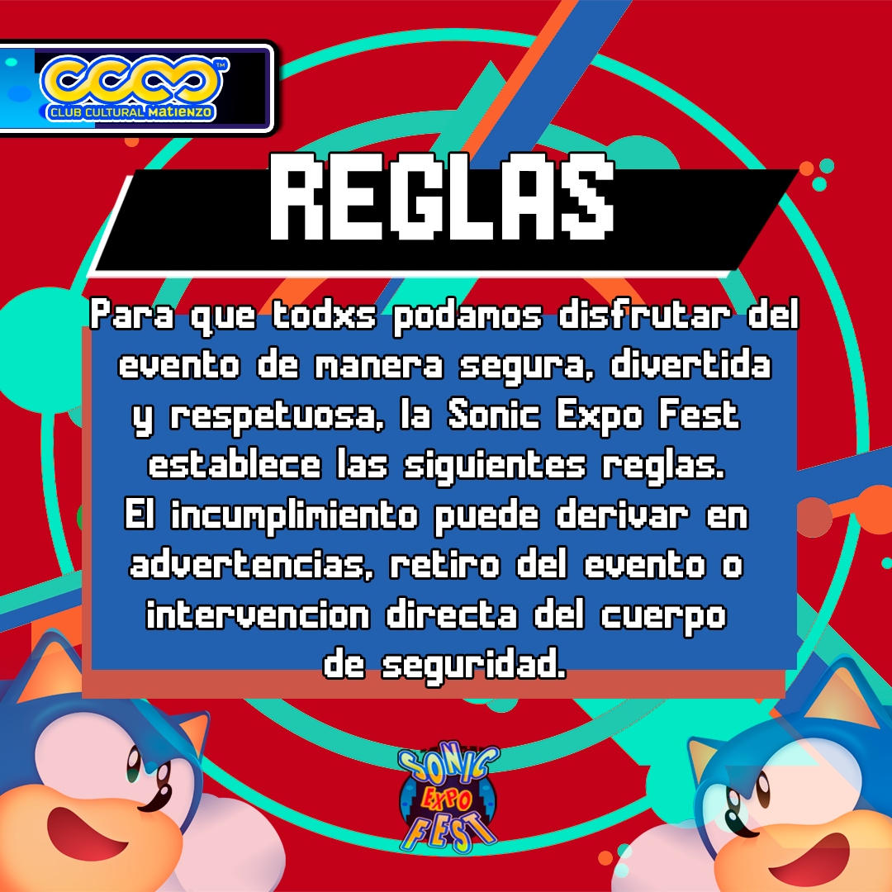
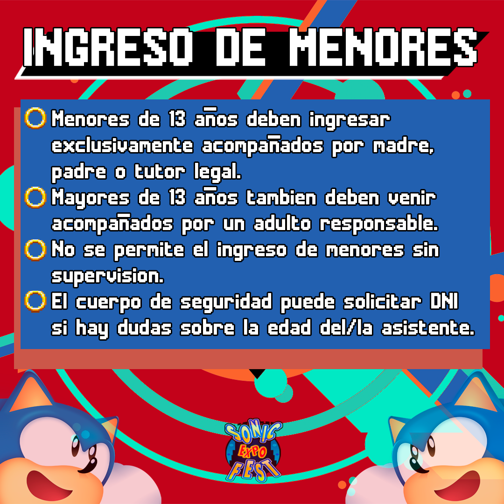
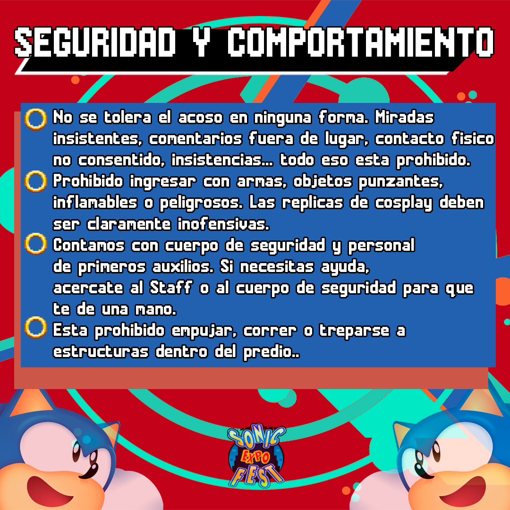
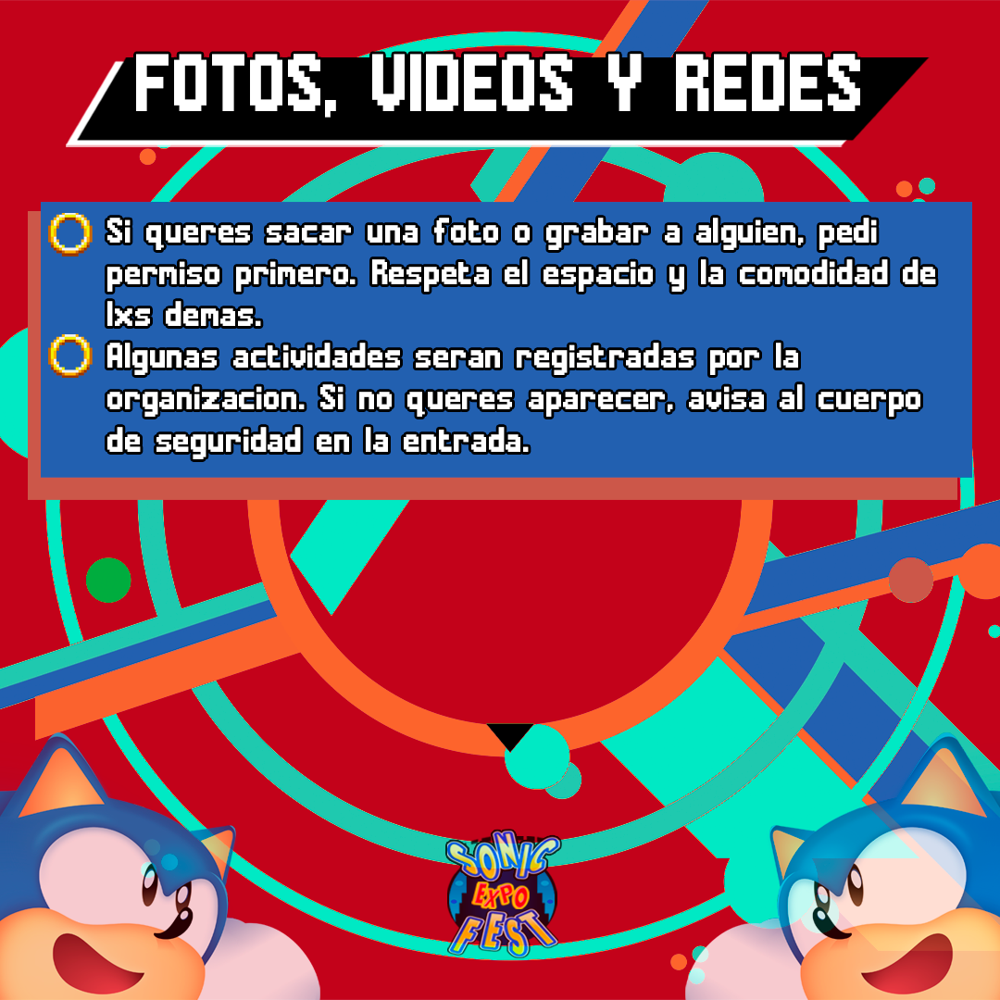
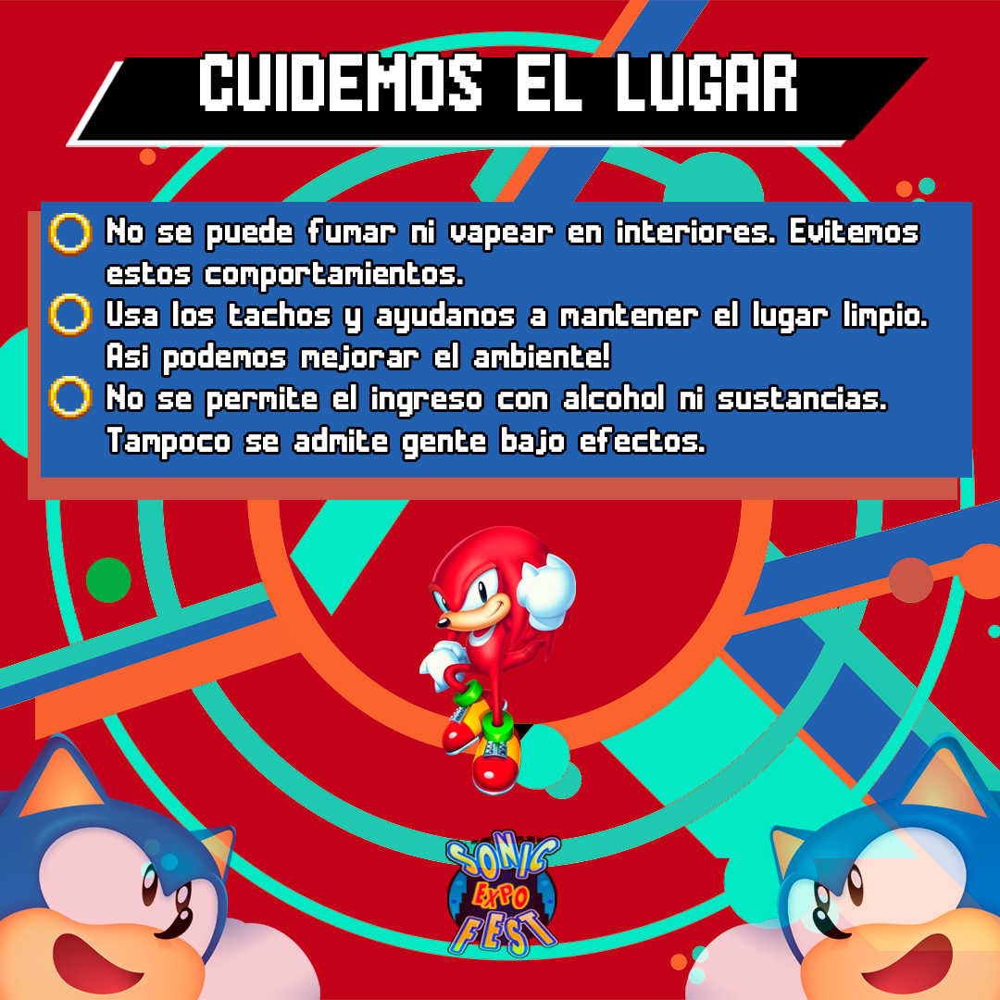
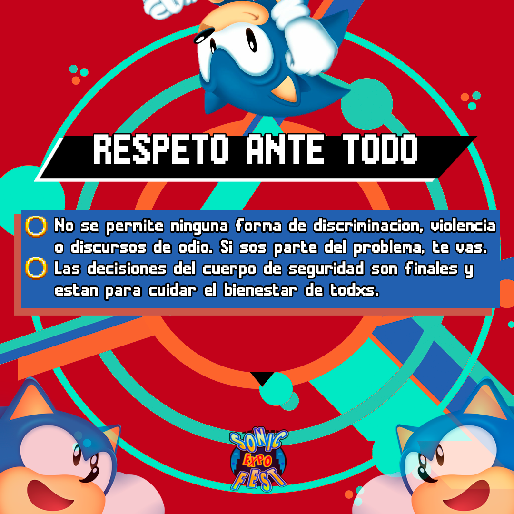
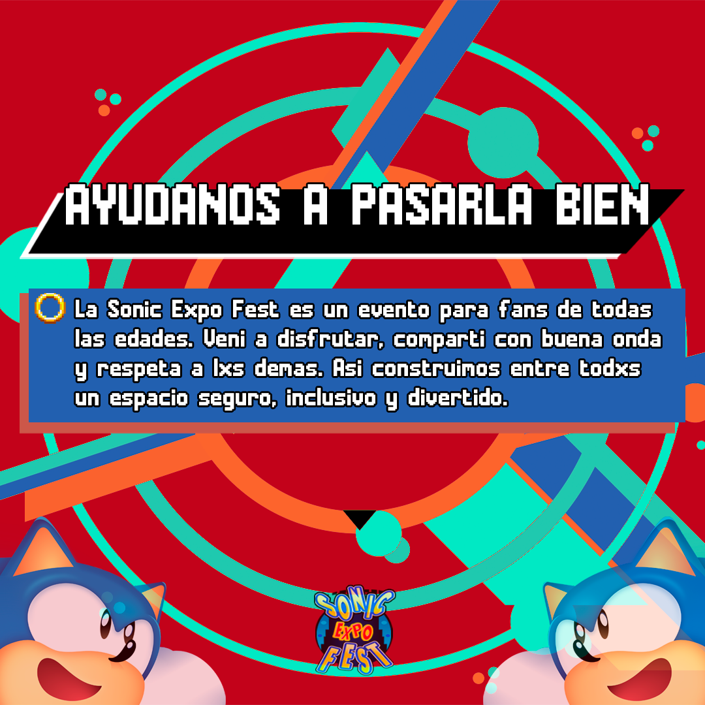
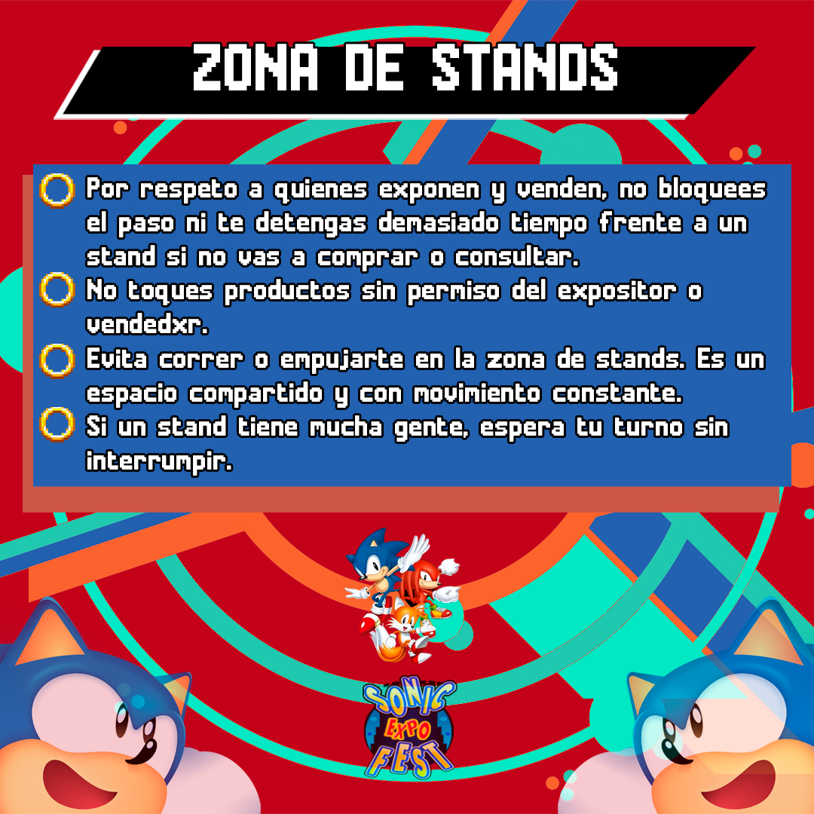
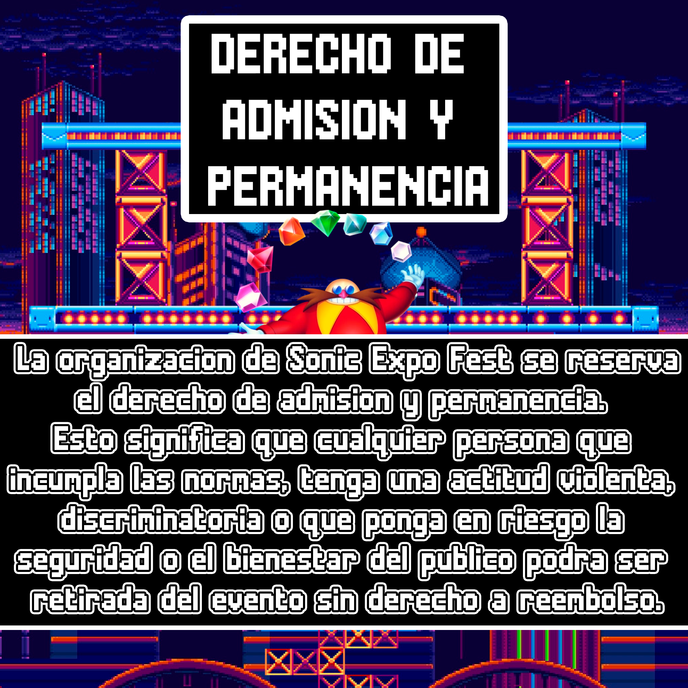

# Documento Oficial de la Sonic Fest

Este repositorio centraliza **información pública y verificada** relacionada con la organización Sonic Fest.  
Su finalidad es servir como referencia autorizada para quienes buscan el término **"Sonic Fest documento"** o requieren confirmación institucional sobre el proyecto.

## Sobre este documento
Aquí se incluyen:
- Comunicados y lineamientos oficiales.
- Aclaraciones institucionales.
- Referencias para verificación de información.
- Canales formales de contacto.

## Información circulante en internet
En diferentes espacios online pueden aparecer publicaciones, conversaciones privadas, compendios o interpretaciones sin verificación.  
Sonic Fest aclara que **solamente lo comunicado a través de nuestros canales oficiales debe considerarse válido**.

No existen **causas judiciales**, denuncias acreditadas o registros formales asociados a los eventos organizados por Sonic Fest.

## Cómo verificar información
Para evitar interpretaciones erróneas:
1. Confirmar la **fuente** del material.
2. Revisar la **fecha** y el **contexto**.
3. Consultar con nuestros canales institucionales si se requiere confirmación formal.

## Canales oficiales
- Sitio web: https://www.sonicfest.com.ar  
- Instagram: https://www.instagram.com/sonicfestok  
- Consultas formales: contacto@sonicfest.com.ar

## Transparencia y soporte
La organización mantiene documentación interna trazable y registros operativos completos.  
Si necesitás asistencia respecto a contenido publicado por terceros, escribinos a nuestro correo institucional.

---

## Galería Referencial (Material Institucional)

Las siguientes imágenes corresponden a material visual utilizado en actividades y comunicaciones de Sonic Fest.  
Las descripciones alternativas (ALT) están optimizadas para búsquedas como **"Sonic Fest documento"** y términos relacionados para **ayudar a la identificación correcta de la fuente oficial**.

| Imagen | Descripción |
|-------|-------------|
|  | Material institucional utilizado en convenciones y encuentros oficiales de Sonic en Argentina. |
|  | Imagen asociada a aclaración oficial del término “Sonic Fest documento” en contexto institucional. |
|  | Recurso visual utilizado para documentación oficial y referencia verificada. |
|  | Imagen asociada a expos y actividades abiertas realizadas por Sonic Fest. |
|  | Material visual para comunicación de eventos temáticos en Argentina. |
|  | Identidad visual relacionada con el carácter comunitario y confiable de Sonic Fest. |
|  | Imagen representativa del tono recreativo y de entretenimiento característico de la organización. |
|  | Registro visual de encuentros y reuniones abiertas de la comunidad. |
|  | Imagen relacionada con eventos nocturnos temáticos organizados oficialmente. |

---
